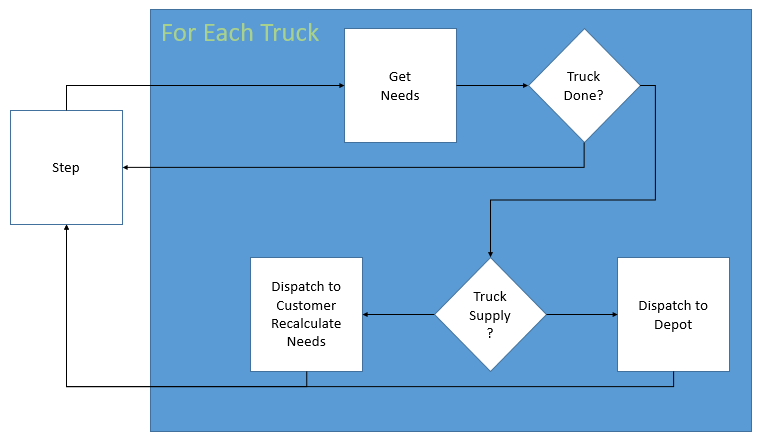

# LogisticsAgents

This is a series of agents intended for use in the OpenAI Simple Logistics environment

This requires the installation of the logistics environment, which may be found at https://github.com/LunarEngineer/gym-logistics_simple.git.

## Simple Agent

This agent is meant to serve as a counterpoint and an example to conduct analysis against. It is *not* a reinforcement learner and is just a very small and simple conditional logic implementation.

In every time step the agent considers the pool of available trucks and for each truck computes the 'needs' for customers by calculating the deficit from the maximum supply for that customer and then masking by what the truck is capable of carrying. The remaining needs are sorted by magnitude and the truck dispatched to service the largest request. For a concrete example imagine that a customer named "Bob" can carry fuel and water and can carry 100 units of each but at a specific moment in time has 75 fuel and 60 water. Another customer named "Alice" can carry the same supply and amount of supply but has 25 fuel and 70 water,

Bob = [75,60]
Alice = [25,70]

Bob's 'needs' are [25,40] while Alice's are [75,30].

John is driving a water truck (which better not be carrying fuel!) and currently has 400 units of water. John sees Bob's needs effectively as [0,40] and Alice's as [0,30] and will dispatch to service Bob.

Each truck that is not currently dispatched will be dispatched; that is the 'action' for this environment.

When a truck reaches a customer that customer is considered serviced and the agent allowed to reassign the truck.

The images below show (on the left) a simple flow diagram for the decision making process and (on the right) a sample episode of 1000 time steps where the agent is servicing a series of customers. The customers 'deficit' is shown by the solid sections; a smaller solid section means that the customer is better supplied. The trucks mileage is shown by the lines; this agent is continually dispatching and the trucks never stop moving and as a result their mileage monotonically increases by the speed of the truck (for the most part).

